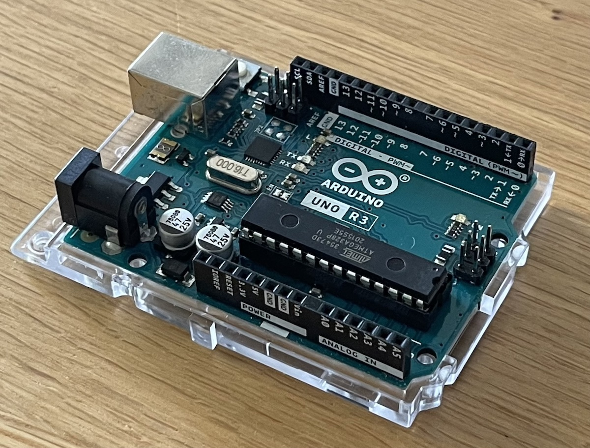
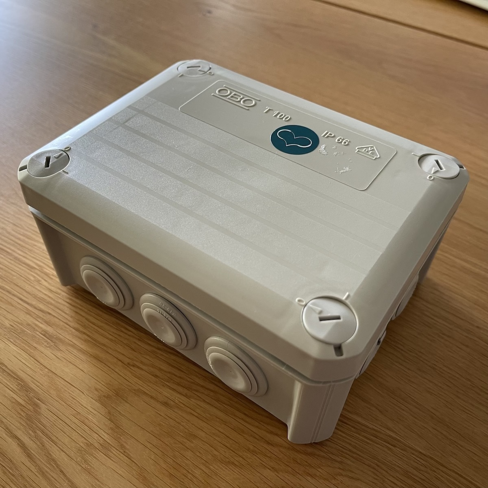
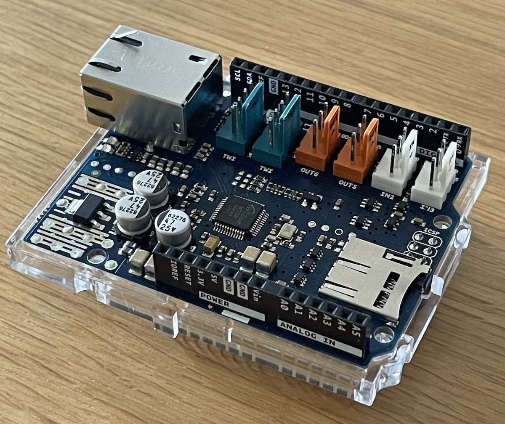
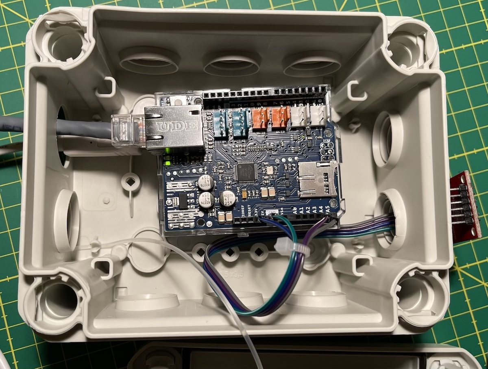
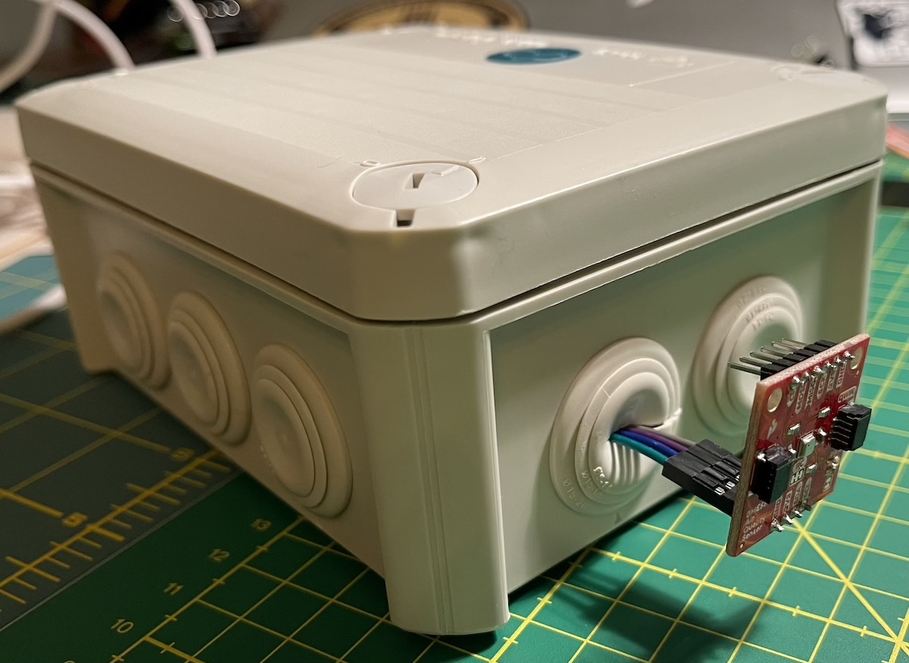
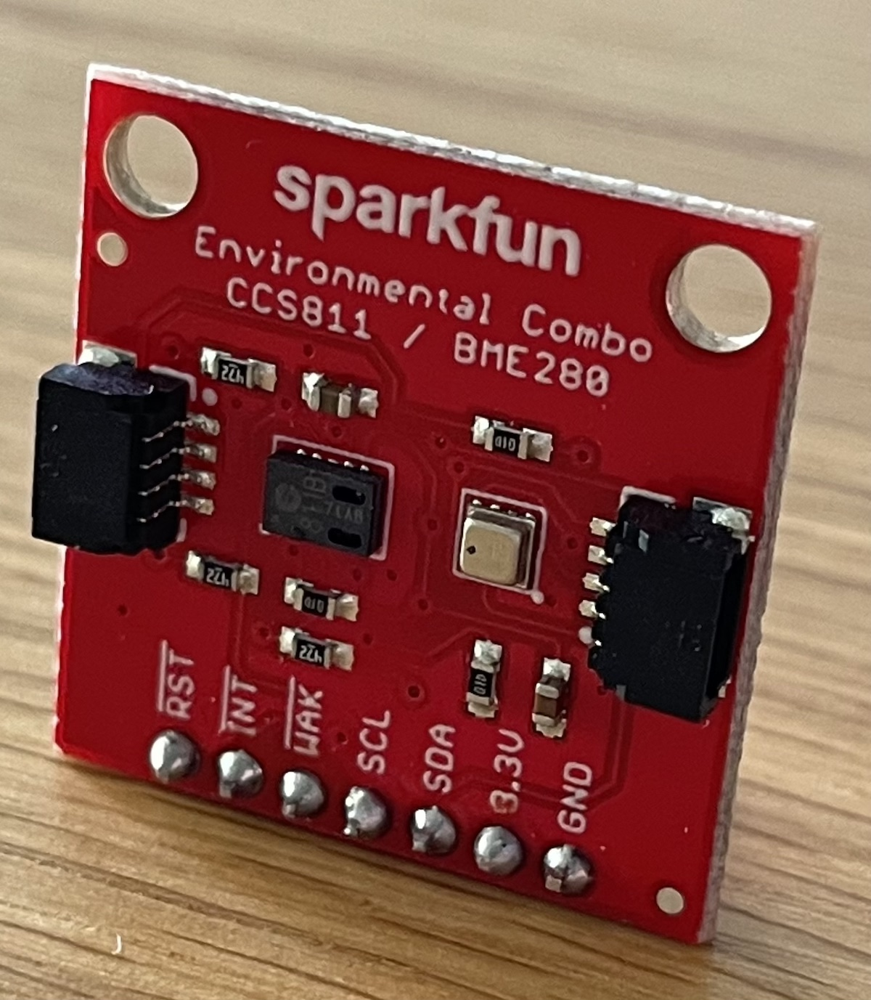

# air-quality-monitor
An IoT device to monitor eCO2 and TVOC based on arduino.

Arduino Uno R3 board
 

IP66 box
 

Arduino Ethernet Shield 2
 

Inside the box
 

Final device
 

Sparkfun Environmental Combo CCS811/BME280
 

