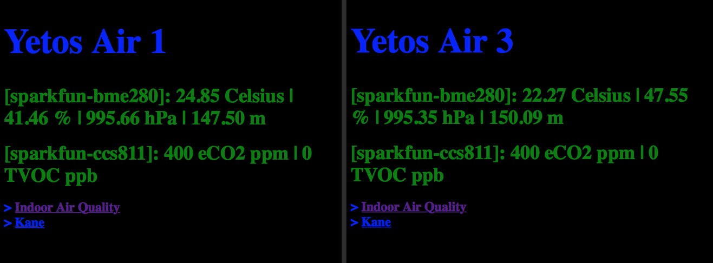

# air-quality-monitor
Air Quality Monitor is an IoT device that is designed to monitor eCO2 and TVOC and is based on the arduino board. By placing a few air quality monitoring devices in critical places indoors, we could determine when the air gets contaminated with covid-19 and take appropriate actions. The project is open sourced under the MIT license and is available for anyone to use or modify at will.

## 1. Intro

This project is based on a few interesting observations that are mentioned in  
[Improving ventilation will help curb SARS-CoV-2](https://www.economist.com/science-and-technology/2021/05/26/improving-ventilation-will-help-curb-sars-cov-2), an article that was published on May 29, 2021 on the Economist magazine. Based on that article, monitoring the eCO2 indoor levels provides us with a rough estimate on how much the air might be contaminated through an covid-19 infected person's breathing.
* Below **500ppm** the ventilation is good. 
* At **800ppm**, 1% of the air someone is breathing has already been exhaled recently by someone else. 
* At **4,400ppm**, this rises to 10%, and would be classed as dangerous. 
* To keep risk low, eCO2 levels should be well below **700ppm**.

## 2. Hardware

The hardware that is needed to build the device consists of an *Arduino Uno R3* board, an *Arduino Ethernet Shield 2*, a *Sparkfun Environmental Combo CCS811/BME280*, 4 dupond cables to connect the sensor to the shield and finaly a box to put them in. Be aware thhough that some soldering will be needed to connect the pins to the sensor breakout board.

### Arduino Uno R3 board

### Arduino Ethernet Shield 2

### Sparkfun Environmental Combo CCS811/BME280

### IP66 box

### Inside the box

## 3. Software

After assembling the device, go ahead and connect the arduino board's usb cable into your development laptop and also connect the ethernet shield to network switch using a utp cable. 

1. In order to build the project you need to get the *Arduino IDE 1.8.13* or later that you can download from [here](https://www.arduino.cc/en/software). 
2. Install the *Sparkfun BME 280* and *Sparkfun CCS811 Arduino Library* on the IDE as described [here](https://www.arduino.cc/en/Guide/Libraries?setlang=en). 
3. Make sure you have selected the appropriate port under the *Tools* menu and then navigating to *Ports* and *Serial Ports*.
4. From the *Tools* menu, go to the *Boards* and select *Arduino AVR Boards* and then *Arduino Uno*.
5. Open the *air_quality_monitor.ino* file and add fill in *TODOs* that stamd out in comment sections of the code depending on your network set up.
6. Finaly, hit run to compile the project.

## 4. Usage

After configuring the device, find a meaningful indoor location to place it and plug it both to power and your network. You can then monitor eCO2 and TVOCs right from the browser of any device connected on your network by selecting the appropriate url address of the device.

